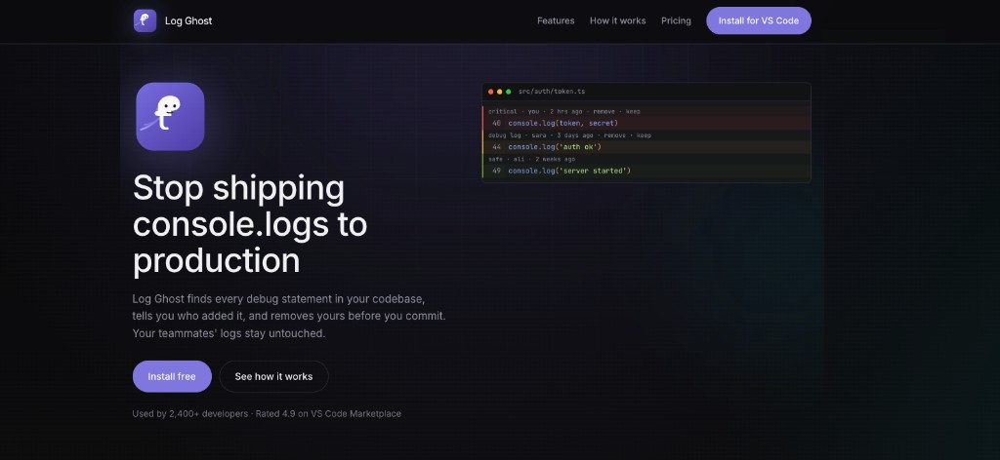

# Log Ghost — website



This repository is the **public marketing site** for [Log Ghost](https://github.com/Abdul-Moiz31) — a dark, developer-focused landing page (Next.js) that explains the product, links to the VS Code Marketplace, and shows how the tool looks in the editor (staged `console.log` lines with severity, author, and remove/keep actions).

**Site copy and structure** are driven by [`data/logghost.json`](./data/logghost.json) (imported at build time). The deployable app only needs this repo; it does not depend on the extension source tree.

---

## The Log Ghost extension (what it is)

**Log Ghost** is a **Visual Studio Code extension** (Cursor-compatible) that finds **debug-style logging** in your project (`console.log`, `print`, language-specific calls, and custom patterns), uses **git blame** to see who last touched each line, and helps you **remove your leftover logs** before they ship. It classifies lines by **severity** (e.g. critical / debug / safe), shows a **Logs** side panel, **CodeLens** above lines, a **status bar** summary, and an optional **pre-commit** check on staged files.

**How to use it (short):**

1. **Install** — In VS Code: Extensions → search **Log Ghost** → Install (or use the Marketplace / `.vsix` from the extension project).
2. **Open a folder** — Works best with a **workspace folder** and **Git** on your `PATH` (needed for blame and the optional hook).
3. **Edit as usual** — The extension scans supported files, highlights log lines, and shows who wrote each one when blame is available.
4. **Clean up** — Use **CodeLens** (remove / keep / ignore) or the **Log Ghost** sidebar to filter, jump to files, and bulk-remove your lines. Configure options under `logGhost.*` in Settings.
5. **Commits (optional)** — If **pre-commit** is enabled, staging files with *your* debug lines can be blocked until you fix or override (`git commit --no-verify` if you must).

For full docs (commands, `logGhost` settings, pre-commit), see the **[extension repository](https://github.com/Abdul-Moiz31/log-ghost)** README.

---

## Develop this site

```bash
cd Log-Ghost-Website
npm install
npm run dev    # http://localhost:3000
npm run build
npm start
```

## Deploy (Vercel)

- **Root directory:** the folder with this `package.json`.
- **Build:** `npm run build` (default Next.js output).
- **Env:** set `NEXT_PUBLIC_SITE_URL` to your live URL (e.g. `https://yoursite.com`) for Open Graph and `metadataBase`. Vercel provides `VERCEL_URL` for previews.

## Project notes

- **Data:** edit [`data/logghost.json`](./data/logghost.json) to change copy; keep in sync with the extension’s `data/logghost.json` if you maintain both.
- **Logos / assets:** `public/log-ghost-purple.svg`, `public/log-ghost-logo.png`, etc.
- **License:** add a `LICENSE` in this repo or reference your main project’s license.
- **Package name:** `log-ghost-website` (npm) — the folder can stay `Log-Ghost-Website`.
